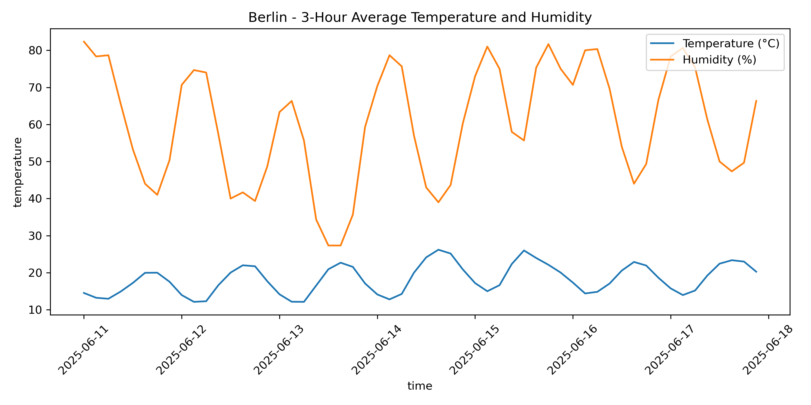

# Weather Data ETL – Real-Time API Extraction & Visualization

This project demonstrates a simple ETL pipeline for weather data using real-time hourly forecast from Open-Meteo API.  
It includes data extraction, resampling, storage in a local SQLite database, visualization, and a simulated streaming output.

---

## Dataset – Open-Meteo Forecast API

- **Source**: [Open-Meteo API](https://open-meteo.com/)
- **Data**: Hourly temperature and humidity forecast
- **Location**: Berlin, Germany (Latitude: 52.52, Longitude: 13.41)
- **Time Range**: 2025-06-11T00:00 to 2025-06-12T00:00
- **API Key**: Not required

**API Query Example:**
https://api.open-meteo.com/v1/forecast?latitude=52.52&longitude=13.41&hourly=temperature_2m,relative_humidity_2m


---

## Performed Steps

### 1. Extraction

- Weather data fetched via `requests` from Open-Meteo API
- Converted from JSON to a Pandas DataFrame
- Quick analysis of shape, columns, data types, and missing values

### 2. Transformation

- `time` column converted to datetime format
- Resampled to 3-hour intervals using `.resample("3H").mean()`

### 3. Load

- Data written to a local SQLite database (`weather_data.db`)

### 4. Visualization

- Line plots of temperature and humidity trends using Seaborn
- Saved as high-resolution PNG (`weather_plot.png`)

### 5. Simulated Streaming

- Printed first 8 rows of resampled data with a 1-second delay between rows to simulate streaming behavior

---

## Output Example



---

## Key Output Files

| Filename             | Description                                 |
|----------------------|---------------------------------------------|
| `weather_data.db`    | SQLite database with 3-hour average data    |
| `weather_plot.png`   | Visualization of temperature & humidity     |

---

## Project Structure
Learning---Portfolio-/
└── Python/
    └── weather_etl_project/
        ├── etl.ipynb
        ├── weather_data.db
        ├── weather_plot.png
        └── README.md

---

## Requirements

Install the required Python packages:

```bash
pip install pandas requests matplotlib seaborn


